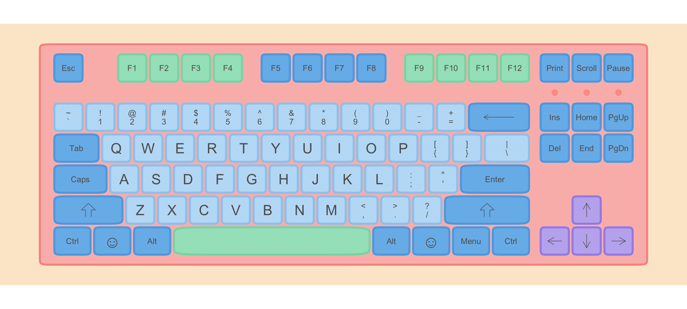
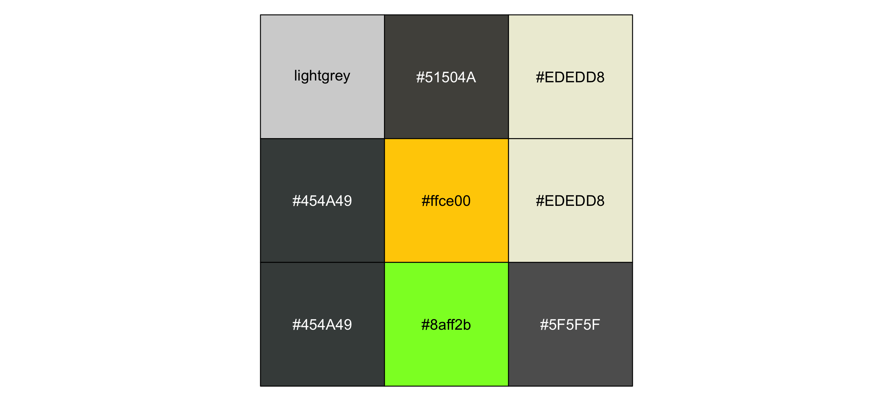
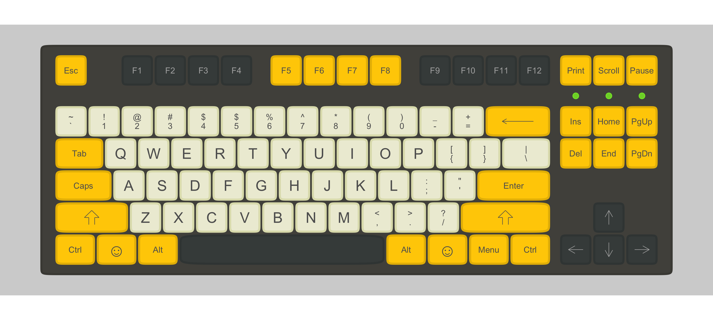
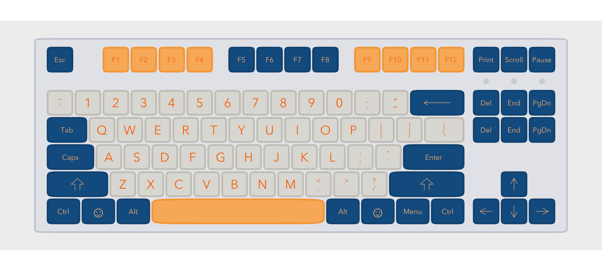
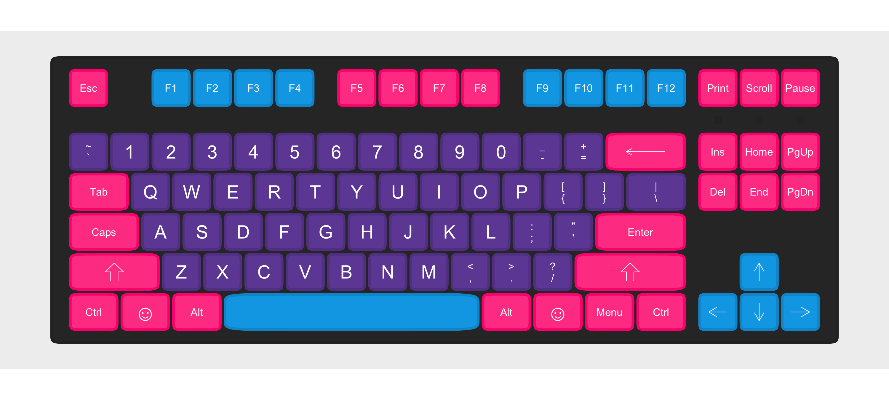
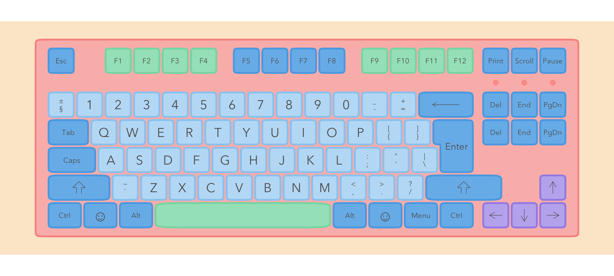

<!-- README.md is generated from README.Rmd. Please edit that file -->

# ggkeyboard

ggkeyboard lets you plot a keyboard and change the colours on it. It’s
cute.

You can install ggkeyboard from github:

``` r
# install.packages("devtools")
remotes::install_github("sharlagelfand/ggkeyboard", ref = "main")
```

Plot a keyboard using `ggkeyboard()`. The default is very cute:

``` r
library(ggkeyboard)

ggkeyboard()
```



You can change the colours, font, sizes, etc. There are a few built in
colour palettes, available via `keyboard_palette()`:

``` r
library(scales)

show_col(keyboard_palette("serika"))
```



This keyboard is inspired by the [Drop + Zambumon MT3 Serika Custom
Keycap
Set](https://drop.com/buy/drop-zambumon-mt3-serika-custom-keycap-set):

``` r
ggkeyboard(palette = keyboard_palette("serika"))
```



This one is inspired by the [Melgeek MG Wahtsy ABS Doubleshot Keycap
Set](https://drop.com/buy/melgeek-mg-wahtsy-abs-doubleshot-keycap-set):

``` r
ggkeyboard(palette = keyboard_palette("wahtsy"))
```



and this one by the [Domikey ABS Doubleshot SA Cyberpunk Pumper Keycap
Set](https://drop.com/buy/domikey-abs-doubleshot-sa-cyberpunk-pumper-keycap-set):

``` r
ggkeyboard(palette = keyboard_palette("cyberpunk"))
```



`ggkeyboard()` defaults to using a tenkeyless keyboard, available in
`tkl`:

``` r
head(tkl)
#> # A tibble: 6 x 4
#>   key        row width number
#>   <chr>    <dbl> <dbl>  <int>
#> 1 Ctrl         1  1.25      1
#> 2 Cmd          1  1.25      2
#> 3 Alt          1  1.25      3
#> 4 Spacebar     1  6.25      4
#> 5 Alt          1  1.25      5
#> 6 ??           1  1.25      6
```

You can use an ISO keyboard and layout by changing the `data` and
`layout`:

``` r
ggkeyboard(tkl_iso, layout = "iso")
```


