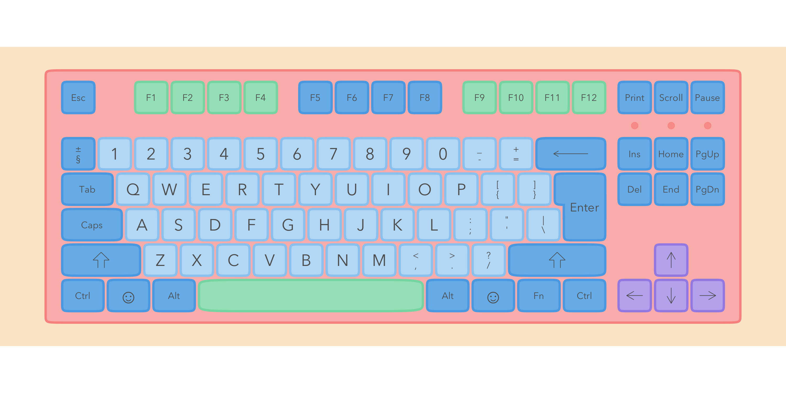

<!-- README.md is generated from README.Rmd. Please edit that file -->

# ggkeyboard

ggkeyboard lets you plot a keyboard and change the colours on it. It’s
cute.

You can install ggkeyboard from github:

``` r
# install.packages("devtools")
devtools::install_github("sharlagelfand/ggkeyboard", ref = "main")
```

Plot a keyboard using `ggkeyboard()`. The default is very cute:

``` r
library(ggkeyboard)

ggkeyboard()
```


You can change the colours, font, sizes, etc. This keyboard is inspired
by the [Drop + Zambumon MT3 Serika Custom Keycap
Set](https://drop.com/buy/drop-zambumon-mt3-serika-custom-keycap-set):

``` r
ggkeyboard(
  keyboard_colour = "#51504A", modifier_colour = "#ffce00", accent_colour = "#454A49",
  alphanum_colour = "#EDEDD8", arrow_colour = "#454A49", font_family = "Courier",
  background_colour = "lightgrey", light_colour = "#8aff2b"
)
```


This one is inspired by the [Melgeek MG Wahtsy ABS Doubleshot Keycap
Set](https://drop.com/buy/melgeek-mg-wahtsy-abs-doubleshot-keycap-set):

``` r
ggkeyboard(
  keyboard_colour = "#E5E7EB", modifier_colour = "#155E90", accent_colour = "#F9B668",
  alphanum_colour = "#DFDED9", arrow_colour = "#155E90", background_colour = "#F0F0F0",
  text_colour = "#f97600"
)
```


and this one by the [Domikey ABS Doubleshot SA Cyberpunk Pumper Keycap
Set](https://drop.com/buy/domikey-abs-doubleshot-sa-cyberpunk-pumper-keycap-set):

``` r
ggkeyboard(
  keyboard_colour = "#313131", modifier_colour = "#FF4893", accent_colour = "#00A8E8",
  alphanum_colour = "#6F4CA4", arrow_colour = "#00A8E8", background_colour = "#F0F0F0",
  text_colour = "white"
)
```


`ggkeyboard()` defaults to using a tenkeyless keyboard, available in
`tkl`:

``` r
head(tkl)
#> # A tibble: 6 x 4
#>   key        row width number
#>   <chr>    <dbl> <dbl>  <int>
#> 1 Ctrl         1  1.25      1
#> 2 Cmd          1  1.25      2
#> 3 Alt          1  1.25      3
#> 4 Spacebar     1  6.25      4
#> 5 Alt          1  1.25      5
#> 6 ??           1  1.25      6
```

You can use an ISO keyboard and layout by changing the `data` and
`layout`:

``` r
ggkeyboard(tkl_iso, layout = "iso")
```


