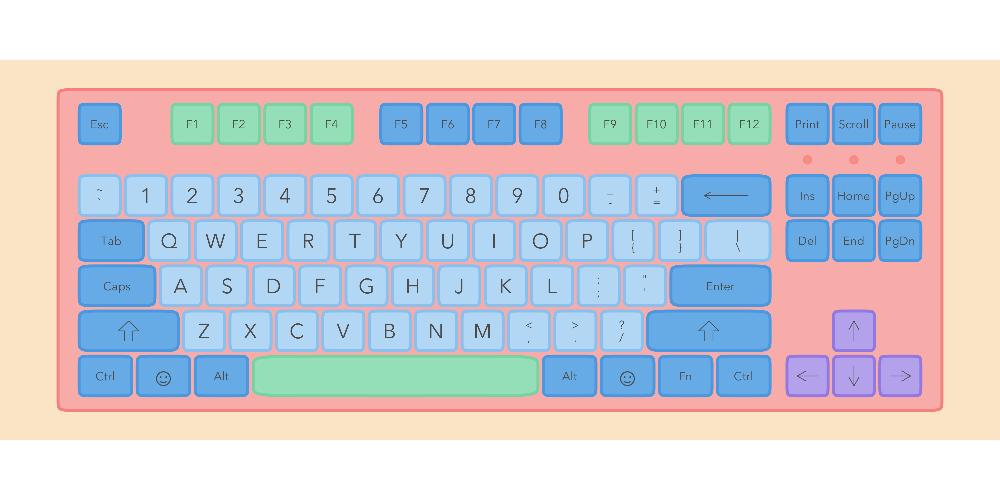
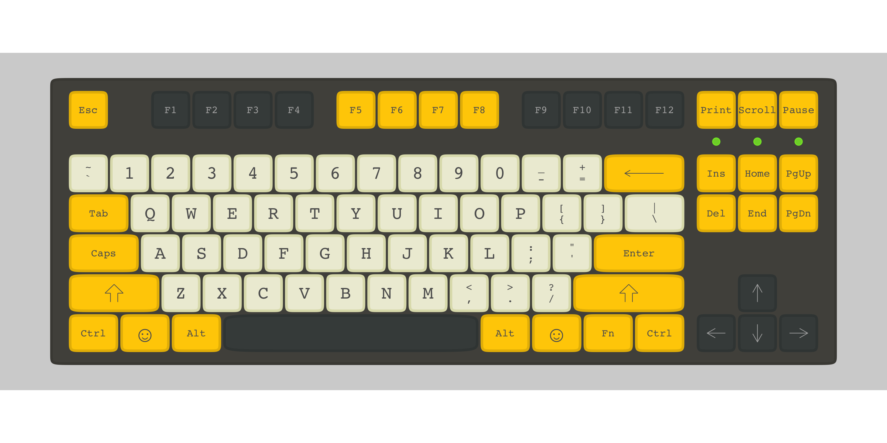
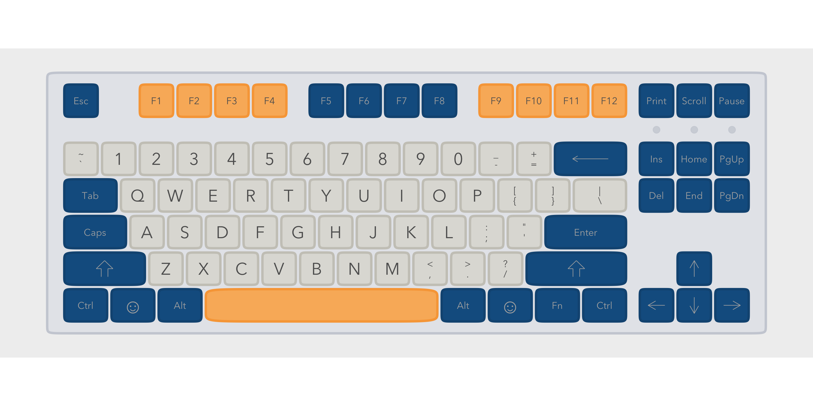
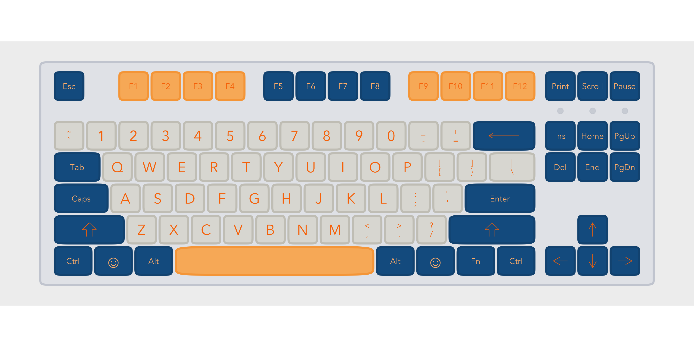

<!-- README.md is generated from README.Rmd. Please edit that file -->

# ggkeyboard

ggkeyboard lets you plot a keyboard and change the colours on it. It’s
cute.

You can install ggkeyboard from github:

``` r
# install.packages("devtools")
devtools::install_github("sharlagelfand/ggkeyboard", ref = "main")
```

Plot a keyboard using `ggkeyboard()`:



You can change the colours, font, sizes, etc. This keyboard is inspired
by the [Drop + Zambumon MT3 Serika Custom Keycap
Set](https://drop.com/buy/drop-zambumon-mt3-serika-custom-keycap-set):



This one is inspired by the [Melgeek MG Wahtsy ABS Doubleshot Keycap
Set](https://drop.com/buy/melgeek-mg-wahtsy-abs-doubleshot-keycap-set):



and this one by the [Domikey ABS Doubleshot SA Cyberpunk Pumper Keycap
Set](https://drop.com/buy/domikey-abs-doubleshot-sa-cyberpunk-pumper-keycap-set):



`ggkeyboard()` defaults to using a tenkeyless keyboard, available in
`tkl`. You can make your own keyboard if you want to go through the
painstaking effort of manually constructing each row and the appropriate
spacing :).

    #> $r1
    #> # A tibble: 12 x 3
    #>    key        row width
    #>    <chr>    <dbl> <dbl>
    #>  1 Ctrl         1  1.25
    #>  2 Cmd          1  1.25
    #>  3 Alt          1  1.25
    #>  4 Spacebar     1  6.25
    #>  5 Alt          1  1.25
    #>  6 ??           1  1.25
    #>  7 Fn           1  1.25
    #>  8 Ctrl         1  1.25
    #>  9 <NA>         1  0.25
    #> 10 Left         1  1   
    #> 11 Down         1  1   
    #> 12 Right        1  1   
    #> 
    #> $r2
    #> # A tibble: 14 x 3
    #>    key        row width
    #>    <chr>    <dbl> <dbl>
    #>  1 "Shift"      2  2.25
    #>  2 "Z"          2  1   
    #>  3 "X"          2  1   
    #>  4 "C"          2  1   
    #>  5 "V"          2  1   
    #>  6 "B"          2  1   
    #>  7 "N"          2  1   
    #>  8 "M"          2  1   
    #>  9 "<\n,"       2  1   
    #> 10 ">\n."       2  1   
    #> 11 "?\n/"       2  1   
    #> 12 "Shift2"     2  2.75
    #> 13  <NA>        2  1.25
    #> 14 "Up"         2  1   
    #> 
    #> $r3
    #> # A tibble: 13 x 3
    #>    key       row width
    #>    <chr>   <dbl> <dbl>
    #>  1 "Caps"      3  1.75
    #>  2 "A"         3  1   
    #>  3 "S"         3  1   
    #>  4 "D"         3  1   
    #>  5 "F"         3  1   
    #>  6 "G"         3  1   
    #>  7 "H"         3  1   
    #>  8 "J"         3  1   
    #>  9 "K"         3  1   
    #> 10 "L"         3  1   
    #> 11 ":\n;"      3  1   
    #> 12 "\"\n'"     3  1   
    #> 13 "Enter"     3  2.25
    #> 
    #> $r4
    #> # A tibble: 18 x 3
    #>    key       row width
    #>    <chr>   <dbl> <dbl>
    #>  1 "Tab"       4  1.5 
    #>  2 "Q"         4  1   
    #>  3 "W"         4  1   
    #>  4 "E"         4  1   
    #>  5 "R"         4  1   
    #>  6 "T"         4  1   
    #>  7 "Y"         4  1   
    #>  8 "U"         4  1   
    #>  9 "I"         4  1   
    #> 10 "O"         4  1   
    #> 11 "P"         4  1   
    #> 12 "[\n{"      4  1   
    #> 13 "]\n}"      4  1   
    #> 14 "|\n\\"     4  1.5 
    #> 15  <NA>       4  0.25
    #> 16 "Del"       4  1   
    #> 17 "End"       4  1   
    #> 18 "PgDn"      4  1   
    #> 
    #> $r5
    #> # A tibble: 18 x 3
    #>    key           row width
    #>    <chr>       <dbl> <dbl>
    #>  1 "~\n`"          5  1   
    #>  2 "1"             5  1   
    #>  3 "2"             5  1   
    #>  4 "3"             5  1   
    #>  5 "4"             5  1   
    #>  6 "5"             5  1   
    #>  7 "6"             5  1   
    #>  8 "7"             5  1   
    #>  9 "8"             5  1   
    #> 10 "9"             5  1   
    #> 11 "0"             5  1   
    #> 12 "_\n-"          5  1   
    #> 13 "+\n="          5  1   
    #> 14 "Backspace"     5  2   
    #> 15  <NA>           5  0.25
    #> 16 "Ins"           5  1   
    #> 17 "Home"          5  1   
    #> 18 "PgUp"          5  1   
    #> 
    #> $r6
    #> # A tibble: 20 x 3
    #>    key      row width
    #>    <chr>  <dbl> <dbl>
    #>  1 Esc        6  1   
    #>  2 <NA>       6  1   
    #>  3 F1         6  1   
    #>  4 F2         6  1   
    #>  5 F3         6  1   
    #>  6 F4         6  1   
    #>  7 <NA>       6  0.5 
    #>  8 F5         6  1   
    #>  9 F6         6  1   
    #> 10 F7         6  1   
    #> 11 F8         6  1   
    #> 12 <NA>       6  0.5 
    #> 13 F9         6  1   
    #> 14 F10        6  1   
    #> 15 F11        6  1   
    #> 16 F12        6  1   
    #> 17 <NA>       6  0.25
    #> 18 Print      6  1   
    #> 19 Scroll     6  1   
    #> 20 Pause      6  1
