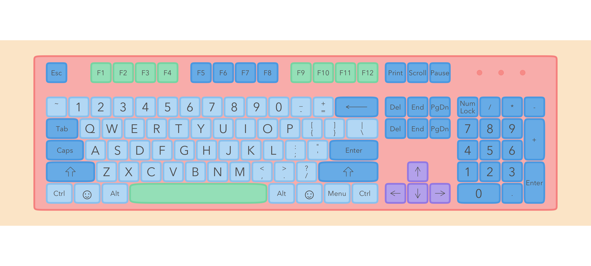
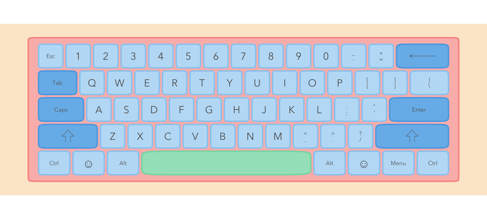

<!-- README.md is generated from README.Rmd. Please edit that file -->

# ggkeyboard

ggkeyboard lets you plot a keyboard and change the colours on it. It’s
cute.

You can install ggkeyboard from github:

``` r
# install.packages("devtools")
devtools::install_github("sharlagelfand/ggkeyboard", ref = "main")
```

Plot a keyboard using `ggkeyboard()`. The default is very cute:

``` r
library(ggkeyboard)

ggkeyboard()
```


You can change the colours, font, sizes, etc. There are a few built in
colour palettes, available via `keyboard_palette()`:

``` r
library(scales)

show_col(keyboard_palette("serika"))
```


This keyboard is inspired by the [Drop + Zambumon MT3 Serika Custom
Keycap
Set](https://drop.com/buy/drop-zambumon-mt3-serika-custom-keycap-set):

``` r
ggkeyboard(palette = keyboard_palette("serika"))
```


This one is inspired by the [Melgeek MG Wahtsy ABS Doubleshot Keycap
Set](https://drop.com/buy/melgeek-mg-wahtsy-abs-doubleshot-keycap-set):

``` r
ggkeyboard(palette = keyboard_palette("wahtsy"))
```


and this one by the [Domikey ABS Doubleshot SA Cyberpunk Pumper Keycap
Set](https://drop.com/buy/domikey-abs-doubleshot-sa-cyberpunk-pumper-keycap-set):

``` r
ggkeyboard(palette = keyboard_palette("cyberpunk"))
```


`ggkeyboard()` defaults to using a tenkeyless keyboard, available in
`tkl`:

``` r
head(tkl)
#> # A tibble: 6 x 8
#>   key      key_label key_type       row number width height layout
#>   <chr>    <chr>     <chr>        <dbl>  <dbl> <dbl>  <dbl> <chr> 
#> 1 Ctrl     Ctrl      alphanumeric     1      1  1.25      1 60%   
#> 2 Win      <NA>      alphanumeric     1      2  1.25      1 60%   
#> 3 Alt      Alt       alphanumeric     1      3  1.25      1 60%   
#> 4 Spacebar <NA>      accent           1      4  6.25      1 60%   
#> 5 Alt      Alt       alphanumeric     1      5  1.25      1 60%   
#> 6 Win      <NA>      alphanumeric     1      6  1.25      1 60%
```

There is also a full keyboard layout available, via `full`:

``` r
ggkeyboard(full)
```



and a 60% layout available via `sixty_percent`:

``` r
ggkeyboard(sixty_percent)
```



You can use an ISO layout by changing `layout` to “iso”:

``` r
ggkeyboard(tkl, layout = "iso")
```


